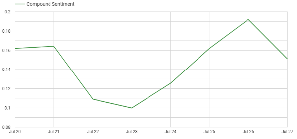
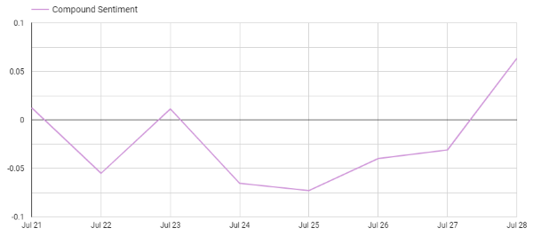

# Vibe Shift
### *A Twitter Sentiment Analysis*

## Technologies Used
* Python
* Apache Airflow
* [SNScrape](https://github.com/JustAnotherArchivist/snscrape)
* [VADER Sentiment Analysis](https://github.com/cjhutto/vaderSentiment) 
* Google BigQuery
* Google Data Studio

A pipeline that uses snscrape to scrape Twitter for tweets on a particular subject matter, pandas to do basic cleaning, VADER sentiment analysis to show public opinion towards the subject, stores the data in a bigquery dataset. Can run reports using Google Data Studio to show changing sentiments over time, automated with Airflow. 


## Setup/Installation Requirements
* In the terminal, clone github repository using the following command;
    ```
    $ git clone https://github.com/jessgschueler/vibe-shift
    ```
    *NOTE- In order to run snscrape Python 3.8 or higher must be used.*
* To run on Airflow: 

    * From inside the main directory, set the .env;
        ```
        echo -e "AIRFLOW_UID=$(id -u)\nAIRFLOW_GID=0" > .env
        ```
    * Initialize Airflow 
        ```
        docker-compose up airflow-init
        ```
    * Run the DAGs in the Airflow GUI from http://localhost:8080

* To run without Airflow:

    * In a venv, Pip install requirements.txt file
    * Retrieve your data set using the following command line command from snscrape, with search term, max number of tweets, date, and file name filled in:
        ```
        snscrape --jsonl --max {number} twitter-search "{search_term} since:{timeframe} > data/{table}.json'
        ```
        For ease of use, make sure your json file name is set to the same name as the table in your config.py

    * Set up config.py with bigquery information, making sure table name matches the name of your json file
    * Run main.py file. 


## Data Studio Examples
Stardew Valley Sentiment Trends 07/20/2022 - 07/27/2022


"Little Miss" Meme Sentiment Trends 07/21/2022 - 07/28/2022



## Known Bugs
* None at this time

## License
MIT

Copyright (c) 7/28/22 Jess Schueler

